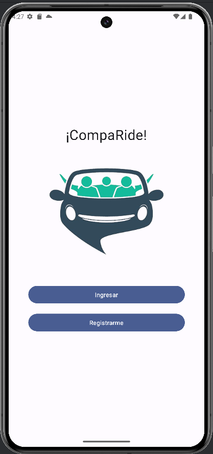

# Shared Travel Development Project

Welcome to our Shared Travel Development Project! This project aims to provide a foundation for creating a login and registration system using Firebase authentication in Kotlin. It is designed with the idea of facilitating shared travel experiences, much like the concept of Uber.

## Overview

This project leverages Firebase authentication for user registration and login functionalities. Firebase provides a robust and secure backend infrastructure, making it an excellent choice for managing user authentication in mobile applications. With this project, developers can quickly integrate Firebase authentication into their Kotlin-based Android applications, enabling seamless user authentication experiences.

## Features

- User Registration: Allows users to create a new account using email and password.
- User Login: Enables users to log in to their existing accounts securely.
- Firebase Integration: Utilizes Firebase Authentication services for user management.
- Secure Authentication: Implements secure authentication practices recommended by Firebase.

## Getting Started

To get started with this project, follow these steps:

1. Clone the repository to your local machine.
2. Open the project in Android Studio.
3. Configure Firebase:
   - Create a new Firebase project on the [Firebase Console](https://console.firebase.google.com/).
   - Add your Android app to the Firebase project and follow the setup instructions.
   - Download the `google-services.json` file and place it in the `app` directory of your project.
4. Build and run the project on your device or emulator.

## Usage

This project serves as a boilerplate for implementing Firebase authentication in Kotlin-based Android applications. Developers can extend this project to include additional features such as profile management, social login, and more, to create a comprehensive shared travel experience application.

## Acknowledgements

Special thanks to Firebase for providing robust authentication services and Kotlin for its elegance and conciseness in Android development.

  

